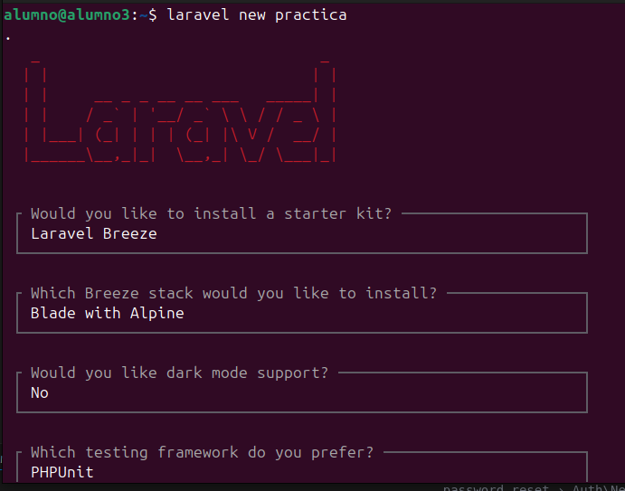
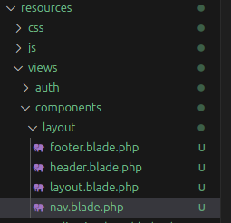
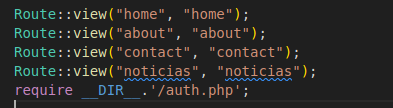
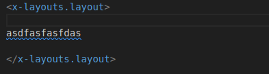
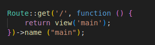
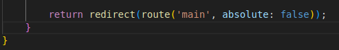
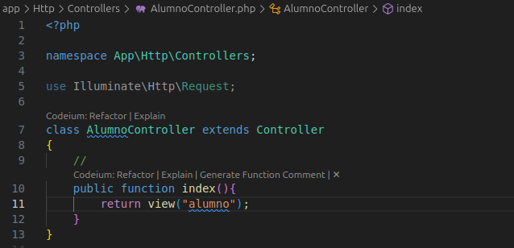
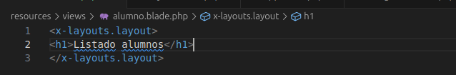
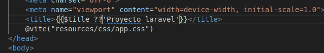
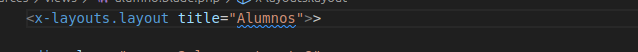

## Creo el proyecto

```bash
laravel new practica, e instalamos Breeze


creo las dependencias


levanto el programa


creo un layout con las carpetas header, nav, footer,y layout



voy a routes y modifico, añado las rutas del resto de paginas




creo la carpeta main.blade.php en la carpeta resources view .Que es como la plantilla base de mi proyecto. cambio lo que había por <x-layout.layout> que indica que se esta utilizando un componente dentro del directorio layout.blade.php.



modificada ruta de logeo, 


en controladores modificado el registered y el authenticated por main


una vez logeado para que me acceda a una de las páginas por ejemplo alumno voy a Controllers - Auth y creo AlumnoController.php


y creo donde va a ir el contenido de la pagina en Components y creo alumno.blade.php


para cambiar que en la pestaña salga donde estamos vamos a Components Layout y poner una variable para indicar donde tiene que apuntar


despues en cada layout de cada pagina añadimos title=... la pagina en la que estemos


En header.blade.php hacemos otro nuevo header para poder acomplar nuestra pagina en modo responsive y ahí colocamos un input establezco un checked que lo asocio a la clase peer y un div, para poder conseguir el menu hamburguesa


Creo un documento llamado docker-compose.yaml. y ahí pondre los servicios que quiero


vamos al fichero .env y modifico a quien le doy acceso


Para crear tablas interactuando con la base de datos ejecuto dos comandos


Fabricamos valores


creo la tabla llamada Alumno


## Acceso a ficheros html: vistas

PARA ACCEDER A PAGINA HTML
> ./resources/views
todas son con extensión --- blade.php ---
puedo (debo) establecr carpetas para organizarlo
No me dejo impresionar por la cantidad de ficheros que hay
en caso de que hayas carpetas. Si quiero acceder o referenciar una carpeta
> carpeta.nombre


## Controladores
> están en app/http/controllers
> El código php que quiero que se ejecute ante una solicitud de una ruta

## Rutas
> La ruta es la url que quiero que mi app tenga
> Las rutas se establecen en ./routes/web.php
> Se especifican con Route::verbo("url",.....)
> Para poner nombre o alias a la ruta  Route::verbo("url"..)->name("alumnos.index")
> Para referenciar una ruta por su nombre uso la función route("nombre")
> Las rutas pueden ser parametrizada (sobre todo haciendo un crud de un recurso).
> Una ruta parametrizada es aquella que en la url hay un parámetro (valor que puede cambiar),
http://alumnos/1 o https://alumnos/5, donde 1 y 5 son el parámetro
> Cuando referencio una ruta por su nombre con la funcion route, para pasar el parámetro siempre lo haré
como segundo

