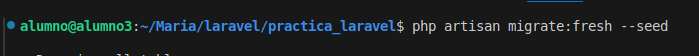
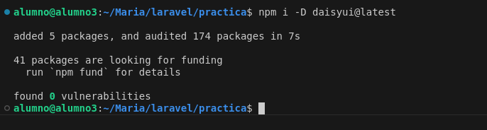
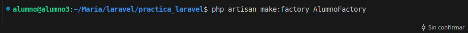
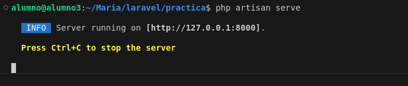
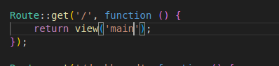

## Creo el proyecto

```bash
laravel new practica, e instalamos Breeze


creo las dependencias



levanto el programa





creo un layout con las carpetas header, nav, footer,y layout


voy a routes y modifico, añado las rutas del resto de paginas




creo la carpeta main.blade.php en la carpeta resources view .Que es como la plantilla base de mi proyecto. cambio lo que había por <x-layout.layout> que indica que se esta utilizando un componente dentro del directorio layout.blade.php.


```
